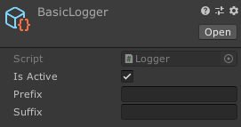

# Empty Platformer project - Documentation - `Logger`

A utility `ScriptableObject` that can be created as an asset to be used as a `Debug.Log()` method without opening a code editor.

For example, this asset can be useful for logging informations from `UnityEvent`s, without creating a custom script.

In the original project, you should be able to find a *BasicLogger* asset, but you can also create new instances of it from `Assets > Create > Utility > Logger`



## Parameters

- **Prefix**: The eventual prefix to add to a message that contains a value.
- **Suffix**: The eventual suffix to add to a message that contains a value.

## Usage

In the demo scene, this asset is used on quite every event of the game, so you can quickly see if there's feedbacks you've not already set.


When using a `Logger` asset as reference in an `UnityEvent` list field, you can call its methods directly from the editor.

## Public API

### Methods

#### `LogMessage()`

```cs
public void LogMessage(string _Message);
```

Logs the given message. Note that *`Prefix`* and *`Suffix`* are not used in that case.

#### `Log()`

```cs
public void Log();
public void Log(string _Data);
public void Log(int _Data);
public void Log(float _Data);
public void Log(bool _Data);
public void Log(Vector3 _Data);
public void Log(Quaternion _Data);
public void Log(GameObject _Data);
```

Logs the given information, adding the defined prefix and suffix. Note that these methods can be used as "dynamic parameters" in `UnityEvent`s.

---

[<= Back to summary](./README.md)